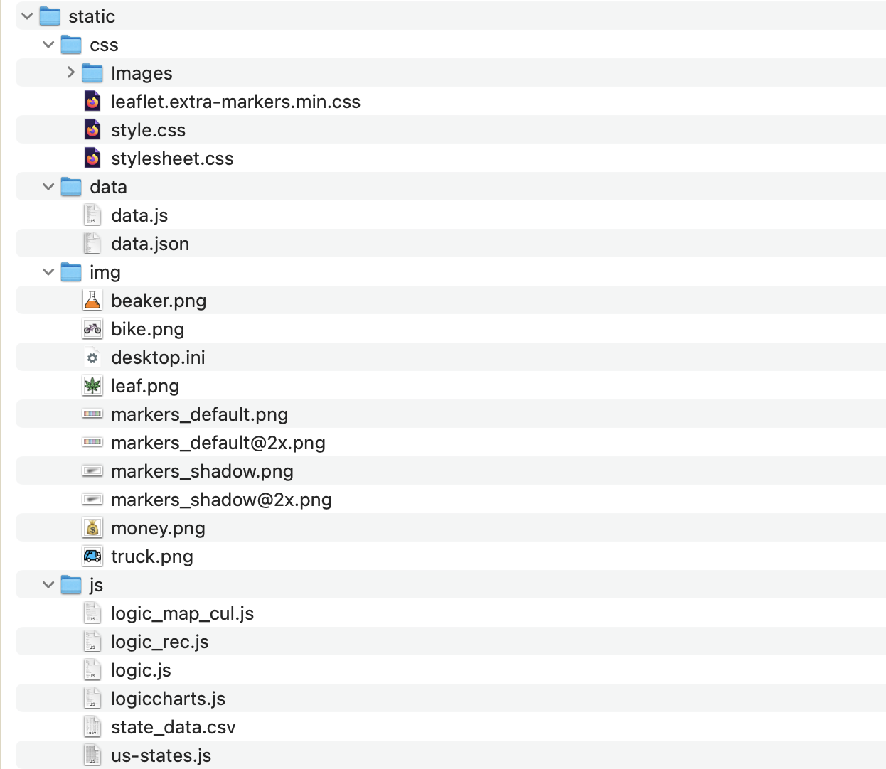

### up-N-smoke
# Team project to examine effects of cannabis in communities

## Overview
The Cannabis Data Project is an initiative aimed at gathering and analyzing data related to cannabis use, legalization, and its impact on crime rates. This project aggregates data from various sources including the FBI Crime Database, Census Bureau, and Cannabis Commissions at the state level.

## Project Goals
- <strong>Data Collection:</strong> Gather comprehensive data related to cannabis legalization by state, sales and associated crime rates with a focus on Massachusetts due to other states data limitations
- <strong>Analysis:</strong> Analyze the collected data to identify trends, correlations, gross sales by recreational and medical, as well as  potential insights into the impact of cannabis legalization and crime
- <strong>Visualization:</strong> Create visualizations to present the findings of the analysis in an accessible and understandable format, utilizing Plotly, bokeh, matplotlib, leaflet, and D3.Json

## Smokestack Building - Data Sources
We compiled nearly a million rows of data from a combination of resources:

- <a href='https://masscannabiscontrol.com/open-data/data-catalog/'><strong>State of Massachusetts</strong></a> 
- <a href='https://https://mjbizdaily.com/map-of-us-marijuana-legalization-by-state/'><strong>National Legalization Data</strong></a> 
- <a href='https://data.boston.gov/dataset/crime-incident-reports-august-2015-to-date-source-ne[…]resource/313e56df-6d77-49d2-9c49-ee411f10cf58?inner_span=True'><strong>Crime Data</strong></a> 

## Data Collection Process

Its an exciting ,frustrating and great learning process for us on this project.We wanted to know where mental health and crime levels affected by legalizing cannabis for recreational use? We found plenty of summaries regarding mental health, but no one was willing to back it up. We reached out to 5 scientists, including Pew Research Center, who published statistical analysis regarding mental health and its relationship with marijuana use to get the data.  No one was willing to back up their claims by sharing their data. Not only was this frustrating, but it causes their assertions to be suspect. After our continual efforts and changing our approach of showing the data analysis , we found data for MA in the above stated sites. We downloaded in JSON,CSV formats

## Data Cleaning
- Perform data cleaning and preprocessing to ensure consistency and accuracy in the collected datasets
- Cannabis business License data for Massachussets was downloaded. The file was missing data for county and latitude/longitude
- The same was retrieved from geoapify website using api calls and reading the response json file
- The response however was not consistent and returned varying structures
- The main file was broken down nto 5 parts to isolate the error records
- The remaining retuned output files were combined to one main file. The manually corrected records were added as well(about 30)
- The file was used to create a pivot chart of businesses by county for analysis
- There was no corelation found between crime data and counties with more businesses
- Data for MA for this is under data/MA/New Folder
- it was also used to create a postgresql database of the license data by county. The visualization however was created using sqllite 
## Ethics
- In our data collection process, we prioritized data ethics by directly requesting datasets from scientists, ensuring responsible and ethical data sourcing practices, as opposed to utilizing platforms like Kaggle or other repositories
- Because of data ethics considerations, it's important to note that the utilized datasets mainly served businesses and crime data which was publicly accessible
  - As a result, utilized data did not contain any personally identifiable information (PII)  
 
The process of locating scientists who have previously conducted similar research and published their findings to serve as validation for the data backup endeavor has encountered significant obstacles, intensifying the ethical dilemmas at hand. Despite diligent efforts, identifying suitable counterparts with comparable studies has proven arduous, casting doubt on the integrity of the backup procedure. This predicament underscores the complexity of ensuring ethical conduct in data management practices. 

## Tools Used
- API Integration
- Bottle/flask
- Py4Web
- Python
- Jupyter NoteBook
- Plotly
- Bokeh
- Matplotlib
- LeafLet
- D3.Js
- PythonAnywhere
- Html
- SQlite
  - SQlite also provides the backend data (database) for our hosted application in PythonAnywhere
## Smoking  the code:
In order to navigate through the analysis follow steps below
- <strong> Root folder:</strong> Up-N-Smoker. This includes below files. 
  - ReadMe
  - index_cul_map.html : Shows the cultivators in MA 
  - index_chart.html   : Shows the Sales Analysis in MA
  - index_rec_med.html : Shows the US states licenses details for Recreational and Medical
  - Jupyter_Notebook 
    - MA_Crime_Data_starter-checkpoint.ipynb : Crime Analysis
    - MA_Crime_Data_starter.ipynb : Crime Analysis
    - Bokeh_seaborn_plotly_diff_chart_Product.ipynb : Sales by Product analysis
    - address2.ipynb : Data cleansing process
    - address license.pgerd (for analysis sqllite was used later) : Address Licenses shown in the Database.

- <strong> data folder:</strong> This folder has all the data file,charts and plots along with background images we used in PythonAnywhere
  - <strong>data/MA:</strong>All data files csv, excel and json files
- <strong> static folder </strong> This folder has all Css,.js,images files as shown in the image

## Analysis and Visualization
### Descriptive Analysis: 
- Conduct descriptive statistical analysis to summarize the characteristics of the collected data
### Correlation Analysis: 
- Explore correlations between cannabis legalization and crime rates using statistical methods
### Interactive Charts:
- Develop interactive charts using libraries like Plotly and Bokeh to visualize trends and patterns in the data to show Massachusetts sales by type (medical vs Recreational) and category
### Geospatial Visualization: 
- Create interactive maps using libraries like Leaflet or Plotly to illustrate the geographical distribution of cannabis-businesses (dispensaries, cultivators, and product manufacturers)
### Links for Data Visualizaions:
- Link to interactive cannabis sales analysis, Massachusetts map for marijuana licensed businesses and database tables: <a href='https://haritha79.pythonanywhere.com/UpNsmoke/'><strong>click here</strong></a>
- Link to interactive national legalization map: <a href='https://haritha3679.github.io/up-N-smoke/'><strong>click here</strong></a>
- Crime analytics : Please run below two Jupyter note books for MA crime analysis.
    - MA_Crime_Data_starter-checkpoint.ipynb : Crime Analysis
    - MA_Crime_Data_starter.ipynb : Crime Analysis

## Contributors
- Carmen Y Wiggins  
- Kathleen Snider-Belinski
- Veethika Singh
- Haritha Koleti
- Michelle Petras

